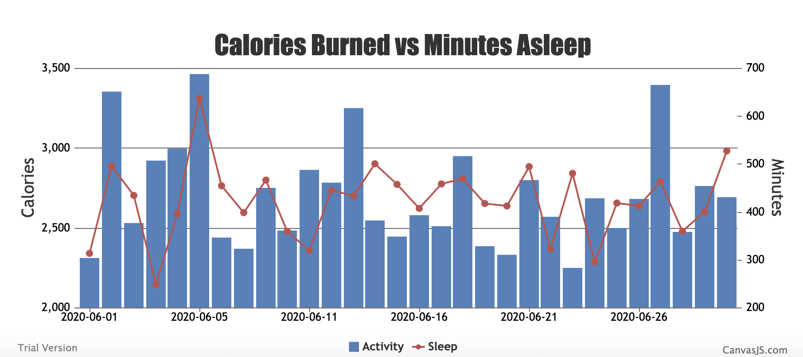

# Health Insights

Health Insights is a front-end application that consumes Fitbit-tracked health data from a locally served API (for now) and graphs that data. Data may be layered on top of each other so that insights into health patterns can be discovered.

*(This is a work in progress)*



## Technology Used

---

This project was generated with [Angular CLI](https://github.com/angular/angular-cli) version 10.0.1.

## Get Started
---

###  Clone the repo

```
git clone 
cd health-patterns-ui
```

### Install NPM pacakages

```
npm install
```

### Start the dev server

```
ng serve
```

Open your browser and navigate to http://localhost:4200/. The app  will automatically reload if you change any of the source files.

